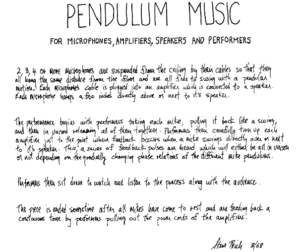
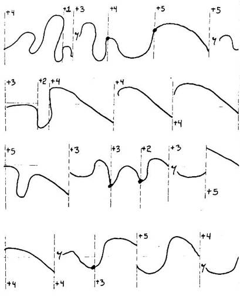
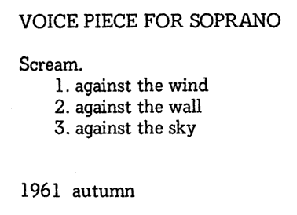

When we talk about scores, we are talking about creating representations and abstractions of music. They are not sound, but instructions for creating it. They are interpreted by someone or something.

**Audio files are not sound itself, but abstract representations of it. Is an mp3 a score?**

## Abstraction

Common abstractions in scores are "notes", "parts", "tempos".

Scores are another way a composer has to elucidate the underlying concepts of their piece. The fields of Musicology and Music Theory rely on this ability to identify, name, and reason about concepts and ideas that are preset in the music.

But what about music which is composed/produced with a DAW or through software? How can we discover and reason about the composer's concept?

**What is the purpose a score?**

**What is assumed? What is left to the discretion of the performer/realizer?**

## Graphic Notation

> Braxton describes #108B as “a series of possible curve line sounds or curve line dynamic changes” (311), implying that the lines can indicate pitch and/or volume, and he likens the music first to “a continuum of stresses and ‘whispers’. 
[What I call a Sound](http://www.criticalimprov.com/article/view/462/992)

youtube.com kaF9Kbksi10

### Yoko Ono - Voice Piece for Soprano

Distilled even further, the score is just a set of instructions. They could be written in plain english.

### Artikulation

Unlike most scores which are the source code to the music, Rainer Wehinger ["Hörpartitur"](https://en.wikipedia.org/wiki/Graphic_notation) or "score for listening" to Ligeti's Artikulation was created _after_ the music was published.

[Articikulation](https://www.youtube.com/watch?v=71hNl_skTZQ)

## Code as score

In the first Computer Music language, [MUSIC](https://en.wikipedia.org/wiki/MUSIC-N#Design), Max Matthews made a distinction between the sound generators and the sound organizers. These are often referred to as the "Orchestra" and the "Score".

The "Orchestra" is the part of your code where you create all your instruments, effects, etc, and the "Score" is the part of your code where you sequence events or set values and dial in and control all the values in the Orchestra.

[CSound Score Notation](http://www.csounds.com/manual/html/ScoreTop.html)

[Tidal Notation](https://toplap.org/tidal/)

There is a similarity between code and scores. Neither is the sound itself, but a representation of the sound/music, meant to be interpreted to be realized. The way your code is written and organized, elucidates your conception of the work.

# Cardew

### Scratch Orchestra

The Scratch Orchestra was an experimental musical ensemble founded in the spring of 1969 by Cornelius Cardew, Michael Parsons and Howard Skempton.

The Orchestra reflected Cardew's musical philosophy at that time. This meant that anyone could join, graphic scores were used (rather than traditional sheet music), and there was an emphasis on improvisation.

[Scratch Orchestra Draft Constitution](http://www.kim-cohen.com/Assets/CourseAssets/Texts/Cardew_Scratch%20Constitution.pdf)

[Alternative Music Notation](http://www.smithsonianmag.com/arts-culture/5-12-examples-of-experimental-music-notation-92223646/)

### Treatise

Treatise is a graphic musical score by British composer Cornelius Cardew (1936-1981) comprising 193 pages of lines, symbols, and various geometric or abstract shapes that eschew conventional musical notation. The score neither contains nor is accompanied by any explicit instruction to the performers in how to perform the work. Cardew worked on the composition from 1963 to 1967.

Cardew had previously suggested that performers devise in advance their own rules and methods for interpreting and performing the work.

Sonic Youth has done a realization of this score. 

[Treatise Score](https://monoskop.org/images/e/e2/Cardew_Cornelius_Treatise_1967.pdf)

Later Cardew became very critical of _Treatise_ and wrote about the "diseases of notation, cases where the notation seems to have become a malignant growth usurping an absolutely unjustifiable preeminence over the music. I feel obliged to study these diseases on my own body, in my own work, rather than as they are evident elsewhere in the avant garde."

[Stockhausen Serves Imperialism](http://www.ubu.com/historical/cardew/cardew_stockhausen.pdf)
